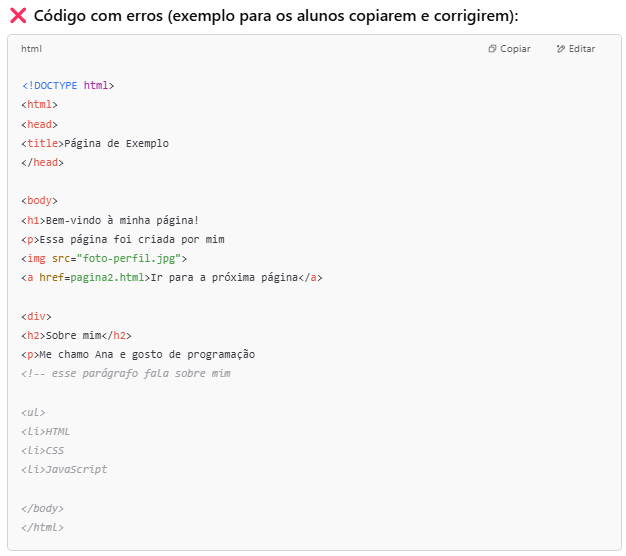

✍️ Exercício Prático: Corrigindo um HTML com Erros

📄 Enunciado:
Você recebeu um arquivo HTML com alguns erros de estrutura, tags mal usadas e falta de organização. Seu desafio é corrigir o código, seguindo as boas práticas de HTML que aprendemos.

